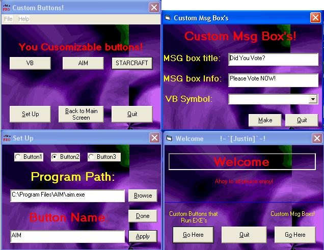



## CuStOm EXE BuTtOnS\!

### Description

You can make your own EXE command buttons and make the button captions! Also included is a Custom message box editor. This was tested may times so the the Error count is 0! PLEASE VOTE!

and leave feedback for improvements or anything else!
 
### More Info
 

             |
---                |---
**Submitted On**   |2004-07-26 09:11:54
**By**             |[Justin Lilley](https://github.com/Planet-Source-Code/PSCIndex/blob/master/ByAuthor/justin-lilley.md)
**Level**          |Beginner
**User Rating**    |5.0 (25 globes from 5 users)
**Compatibility**  |VB 6\.0
**Category**       |[Custom Controls/ Forms/  Menus](https://github.com/Planet-Source-Code/PSCIndex/blob/master/ByCategory/custom-controls-forms-menus__1-4.md)
**World**          |[Visual Basic](https://github.com/Planet-Source-Code/PSCIndex/blob/master/ByWorld/visual-basic.md)
**Archive File**   |[CuStOm\_EXE1774477262004\.zip](https://github.com/Planet-Source-Code/justin-lilley-custom-exe-buttons__1-55197/archive/master.zip)

